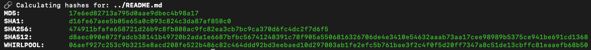

# kollision

kollision is a simple bash script to calculate md5, sha1, sha256, sha512, and whirlpool hashes of a file.

```bash
./kollision.sh -f <file>
```



<u>Requirements:</u> [OpenSSL](https://openssl.org/) must be installed on your maschine.